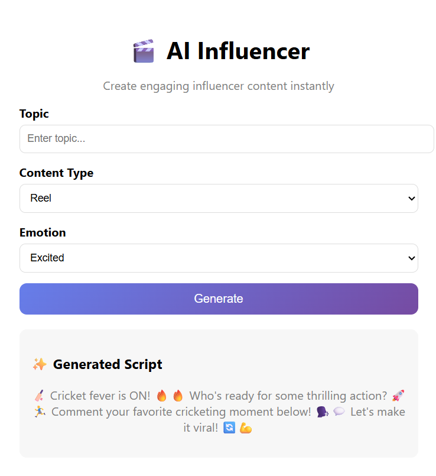

#  AI-Powered Virtual Influencer System  
### Automated Multimedia Content Creation Platform

The AI-Powered Virtual Influencer System is an end-to-end platform designed to automate the creation of digital influencer content using Artificial Intelligence.

It enables users to generate scripts, visuals, and multimedia content through AI models, reducing manual effort and accelerating content production workflows.

This project integrates AI models, backend APIs, and an interactive UI to deliver a seamless content creation experience.


##  Features
-  AI Script Generation
-  Text-to-Speech (Voice Creation)
-  AI Avatar / Influencer Creation
-  Automated Video Generation
-  Web-based UI Interface
-  End-to-End Content Pipeline

## Architecture
```bash
                ┌──────────────────────┐
                │      Frontend UI     │
                │ (HTML, CSS, JS)      │
                └─────────┬────────────┘
                          │
                          ▼
                ┌──────────────────────┐
                │   Flask Backend API  │
                │ (Routing & Control)  │
                └─────────┬────────────┘
                          │
        ┌─────────────────┼─────────────────┐
        ▼                 ▼                 ▼
┌──────────────┐  ┌──────────────┐  ┌──────────────┐
│ Script Gen   │  │ Voice Gen    │  │ Image/Video  │
│ (LLM Module) │  │ (TTS Engine) │  │ Generator    │
└──────┬───────┘  └──────┬───────┘  └──────┬───────┘
       │                 │                 │
       └────────┬────────┴────────┬────────┘
                ▼                 ▼
        ┌──────────────────────────────┐
        │   Content Assembly Module    │
        │ (Sync Script + Media + Voice)│
        └──────────────┬───────────────┘
                       ▼
        ┌──────────────────────────────┐
        │   Output Generator           │
        │ (Final Video / Content)      │
        └──────────────┬───────────────┘
                       ▼
        ┌──────────────────────────────┐
        │ Storage / Assets / Database  │
        └──────────────┬───────────────┘
                       ▼
        ┌──────────────────────────────┐
        │ Publishing & Analytics Layer │
        │ (Future Scope)               │
        └──────────────────────────────┘
```

## Workflow
```bash
User Input
   ↓
Script Generation (LLM)
   ↓
Media Generation (Image/Video)
   ↓
Voice Synthesis (TTS)
   ↓
Content Assembly
   ↓
Final Output
```
## Tech Stack
- Frontend: HTML, CSS, JavaScript
- Backend: Flask / Python
- AI Tools: LLMs, Image Generation APIs

## Installation Guide
### Clone Repository
- git clone https://github.com/RajVerma421/Al-Powered-Virtual-Influencer-System-for-Automated-Multimedia-Content-Creation.git

### Navigate to Project
- cd Al-Powered-Virtual-Influencer-System-for-Automated-Multimedia-Content-Creation

### Create Virtual Environment
- python -m venv venv

### Activate Environment
- venv\Scripts\activate

### Install Dependencies
- pip install -r requirements.txt

### Run Backend
- python app.py

## Project Structure
```bash
├── frontend/        # UI files
├── backend/         # Flask backend
│   ├── app.py
│   ├── routes/
│   ├── services/
├── ai_modules/      # AI logic
├── assets/          # Images, videos
├── requirements.txt
└── README.md
```

##  How It Works

1. User enters a prompt
2. AI generates script
3. TTS converts script to voice  
4. Visual content is generated  
5. System combines all components
6. Final content is delivered

## Demo



## Future Scope
- Add real-time posting to social media
- Improve AI personalization
- Add analytics dashboard
  
## Contributors
- Yash Sharma
- Ankit Yadav
- Raj Kumar Verma
